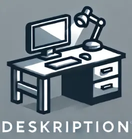

# Deskription

## À propos

Développement d'une application de visualisation et de traçage des mobiliers dans les bâtiments tertiaires réalisé dans le cadre de la formation [Ingénieur en Informatique et Systèmes d'Information (SI), CNAM](https://www.itii-alsace.fr/formations/informatique-et-systemes-dinformation-le-cnam/), pour le module Projet d'étude de [Alcatel Lucent](https://www.al-enterprise.com/).

## Documentation

- [Sujet](./docs/sujet.md)
- [User Stories](https://docs.google.com/spreadsheets/d/1Vl2dMxTCKQXvUd2BLxcnjJV7LUs8H6GdDjXqUoFAd9I/edit?gid=0#gid=0)
- [Environnement de Développement + Conventions](./docs/developpement.md)
- [Environnement de Production et Serveur](./docs/production.md)

## Membres du groupe

- [Danaé ALBRECHT--MARTIN](https://github.com/dalbrechtmartin)
- [Gwénolé ALLAL](https://github.com/gwenaf)
- [Quentin BRENNER](https://github.com/OneLiberty)
- [Axel FISCHBACH](https://github.com/SolxR)
- [Christopher GERARD](https://github.com/Christ0u)
- [Théo LUDWIG](https://github.com/theoludwig)
- [Jeannot NAEGELY](https://github.com/Skullkrash)
- [Mathys PIERREZ](https://github.com/mpierrez)
