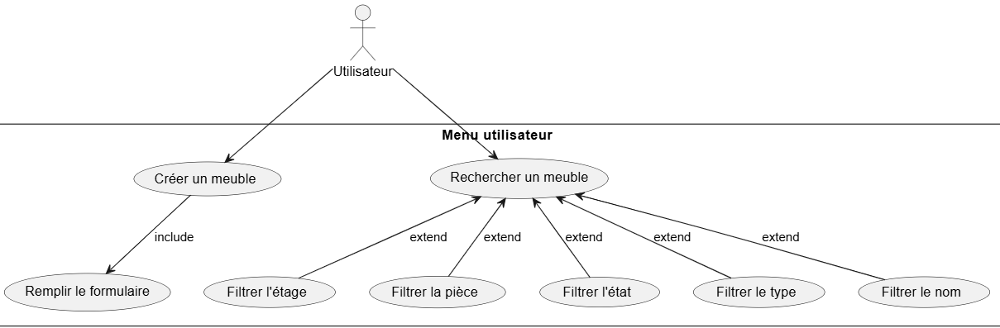
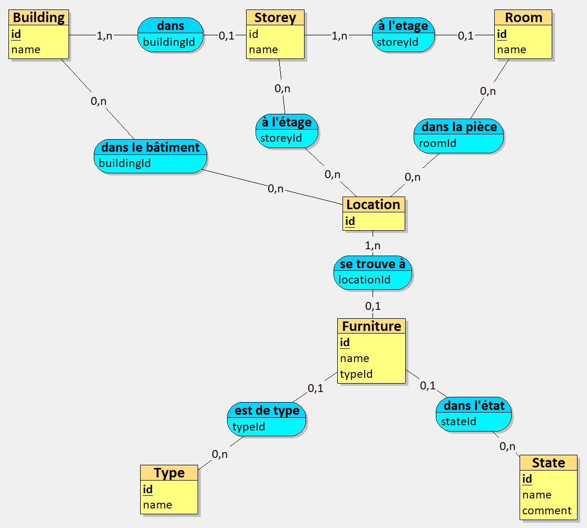
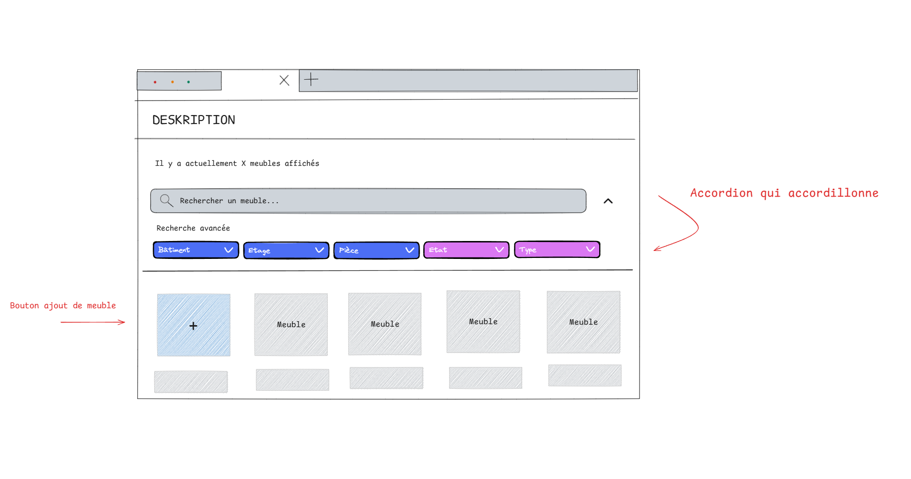

# Deskription - Préparation à la mise en pause (13/06/2025)

## À propos

Développement d'une application de visualisation et de traçage des mobiliers dans les bâtiments tertiaires réalisé dans le cadre de la formation [Ingénieur en Informatique et Systèmes d'Information (SI), CNAM](https://www.itii-alsace.fr/formations/informatique-et-systemes-dinformation-le-cnam/), pour le module Projet d'étude de [Alcatel Lucent](https://www.al-enterprise.com/).

L'application est déployée et disponible à l'adresse suivante: [https://deskription.theoludwig.fr](https://deskription.theoludwig.fr).

Le code source du projet est sur [GitHub](https://github.com/cnam-theoludwig/cnam-deskription).

Les User Stories sont sur le [Google Sheets](https://docs.google.com/spreadsheets/d/1Vl2dMxTCKQXvUd2BLxcnjJV7LUs8H6GdDjXqUoFAd9I/edit?gid=0#gid=0).

### Membres du groupe

- [Danaé ALBRECHT--MARTIN](https://github.com/dalbrechtmartin)
- [Gwénolé ALLAL](https://github.com/gwenaf)
- [Quentin BRENNER](https://github.com/OneLiberty)
- [Axel FISCHBACH](https://github.com/SolxR)
- [Christopher GERARD](https://github.com/Christ0u)
- [Théo LUDWIG](https://github.com/theoludwig)
- [Jeannot NAEGELY](https://github.com/Skullkrash)
- [Mathys PIERREZ](https://github.com/mpierrez)

## 1. Principaux Outils Informatiques Utilisés

- [TypeScript](https://www.typescriptlang.org/): Langage de programmation.
- [Angular](https://angular.dev/): Interface utilisateur (UI) et principal frontend de l'application.
- [oRPC](https://orpc.unnoq.com/) : API et principal backend de l'application.
    - [kysely](https://kysely.dev/): Générateur de requêtes SQL avec vérification de type.
    - [zod](https://zod.dev): Validation des données basée sur un schéma.

### Prérequis au développement

- [Node.js](https://nodejs.org/) >= v22.12.0 [(`nvm install 22`)](https://nvm.sh)
- [pnpm](https://pnpm.io/) v10.11.1 [(`corepack enable`)](https://nodejs.org/docs/latest-v22.x/api/corepack.html)
- [Docker](https://www.docker.com/)

Les étapes pour lancer le projet en local sont expliqués sur le [GitHub](https://github.com/cnam-theoludwig/cnam-deskription) du projet.

## 2. Solution

### 2.1 Cas d'utilisation

 

 

### 2.2 Modèle Conceptuel de Données (MCD)

### 2.3 Interface Utilisateur

## 3. Retour

### 3.1 Organisation du Redémarrage

Pause du développement et reprise en Septembre. Organisation d'une réunion de redémarrage (distanciel), ayant pour objectif d'attribuer les tâches restantes et de mettre à jour le backlog.

### 3.2 Changement de technologies

Potentiel ajout de bibliothèque, pas de changement de technologie majeur.

### 3.3 Intéractions avec projets connexes

Aucune interaction avec d'autre projet pour notre sujet
